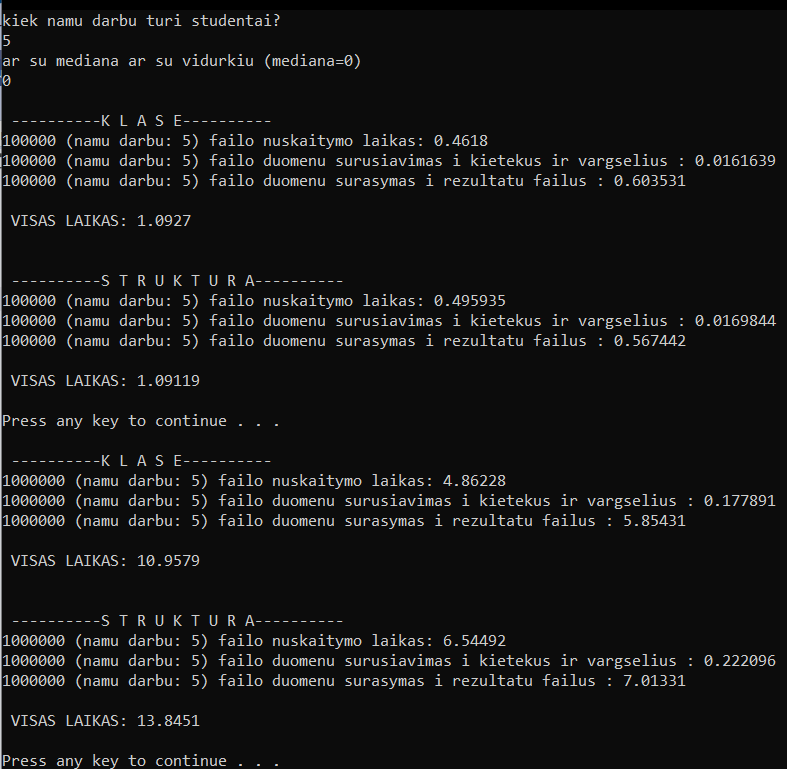

# V1.1
## realizuota užduotis naudojant klasę
Programa atlieka tą pačią užduotį dviem skirtingais būdais ir atlieka spartos analizę (skaičiuoja tam tikrų programos vietų atlikimo greitį).
## rezultatai

## pastaba
Dar nėra padaryta testų su skirtingais flag'ais.
